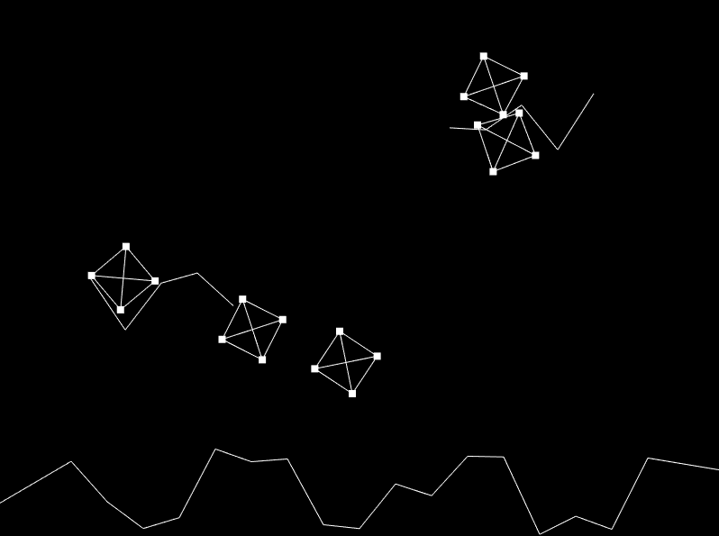

# cljs-mpd
Mass Point Dynamics Engine for ClojureScript

run :

```shadow-cljs watch app```



[Live Demo](https://milgra.github.io/cljs-mpd/index.html)

## Features

* Adaptive time stepping
* Mass points with radius, weight and elasticity
* Distance guards for rigid body simulation
* Angle guards for skeleton simulation

## Usage

* Copy src/mpd to your project src folder
* Check out scenes.cljs how to set up a scene
* Check out core.cljs/main how to iterate through phy2 functions

## Todo

* curtain demo scene
* refine proximity/collosion to calm particles and angle guards
* write tests
